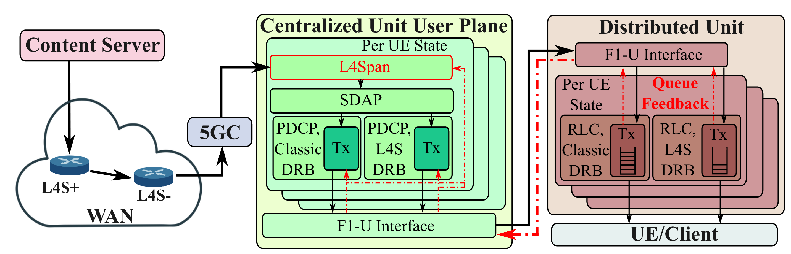

# L4Span

**L4Span** is a prototype implementation for Low-Latency Low-Loss and Scalable (L4S) congestion signal architecture in the 5G network to achieve ultra-low sojourn time in the RLC buffer while maintaining a good capacity usage. L4Span is located above the SDAP layer to perform the ECN marking for 1) uplink ACK packet to short-circuit the RAN if possible (for TCP traffic) or 2) downlink packet to enable generic L4S marking mechanism (for UDP or QUIC traffic).



L4Span is [published](https://doi.org/10.1145/3768972) in ACM CoNEXT 2025: if you use this code, we ask that you cite our paper.

```
@article{10.1145/3768972,
author = {Wan, Haoran and Jamieson, Kyle},
title = {L4Span: Spanning Congestion Signaling over NextG Networks for Interactive Applications},
year = {2025},
issue_date = {December 2025},
publisher = {Association for Computing Machinery},
address = {New York, NY, USA},
volume = {3},
number = {CoNEXT4},
url = {https://doi.org/10.1145/3768972},
doi = {10.1145/3768972},
journal = {Proc. ACM Netw.},
month = nov,
articleno = {25},
numpages = {25},
keywords = {5G Network; Congestion Control; ECN Feedback; L4S Architecture}
}
```

L4Span is implemented on top of the [srsRAN Project](https://www.srsran.com/). Build instructions and user guides for srsRAN Project - [srsRAN Project documentation](https://docs.srsran.com/projects/project).

Build Preparation
-----------------

### Dependencies

* Build tools:

  * cmake:               [https://cmake.org/](https://cmake.org/)
* Mandatory requirements:

  * libfftw:             [https://www.fftw.org/](https://www.fftw.org/)
  * libsctp:             [https://github.com/sctp/lksctp-tools](https://github.com/sctp/lksctp-tools)
  * yaml-cpp:            [https://github.com/jbeder/yaml-cpp](https://github.com/jbeder/yaml-cpp)
  * mbedTLS:             [https://www.trustedfirmware.org/projects/mbed-tls/](https://www.trustedfirmware.org/projects/mbed-tls/)
  * googletest:          [https://github.com/google/googletest/](https://github.com/google/googletest/)

You can install the build tools and mandatory requirements for some example distributions with the commands below:

<details open>
<summary><strong>Ubuntu 22.04</strong></summary>

```bash
sudo apt-get install cmake make gcc g++ pkg-config libfftw3-dev libmbedtls-dev libsctp-dev libyaml-cpp-dev libgtest-dev
```

Build and Run Instructions
--------------------------

First, clone the L4Span Project repository:

```bash
    git clone git@github.com:PrincetonUniversity/L4Span.git
```

Then build the code-base:

```bash

    cd L4Span
    mkdir build
    cd build
    cmake ../ 
    make -j $(nproc)
    make test -j $(nproc)
```

Start the [Open-5GS](https://open5gs.org/open5gs/docs/guide/01-quickstart/) as the 5G core. 

And use the configuration file in `config/l4span/cu.yml` and `config/l4span/du_rf_b200_tdd_n78_20mhz.yml` as the CU and DU configuration files.

```bash
cp config/l4span/cu.yml build/app/cu/
cp config/l4span/du_rf_b200_tdd_n78_20mhz.yml build/app/du/
cd build/app/cu
sudo ./srscu -c cu.yml
# in another terminal window
cd build/app/du
sudo ./srsdu -c du_rf_b200_tdd_n78_20mhz.yml
```

Then, you can connect your phone into the RAN and test with the L4S-enabled congestion control scheme in the downlink direction with the [L4S kernel](https://github.com/L4STeam/linux). We tested with the Moto G 5G phones and Amarisoft UE Emulator.

## File Structure

All our implementations of the L4Span functionalities are in the directory of `lib/mark` and `include/mark`, check these files to enable short-circuiting uplink packet marking or downlink packet marking. Please also refer to `lib/cu_up/pdu_session_manager_impl.cpp` on the creation of the L4Span entity.
